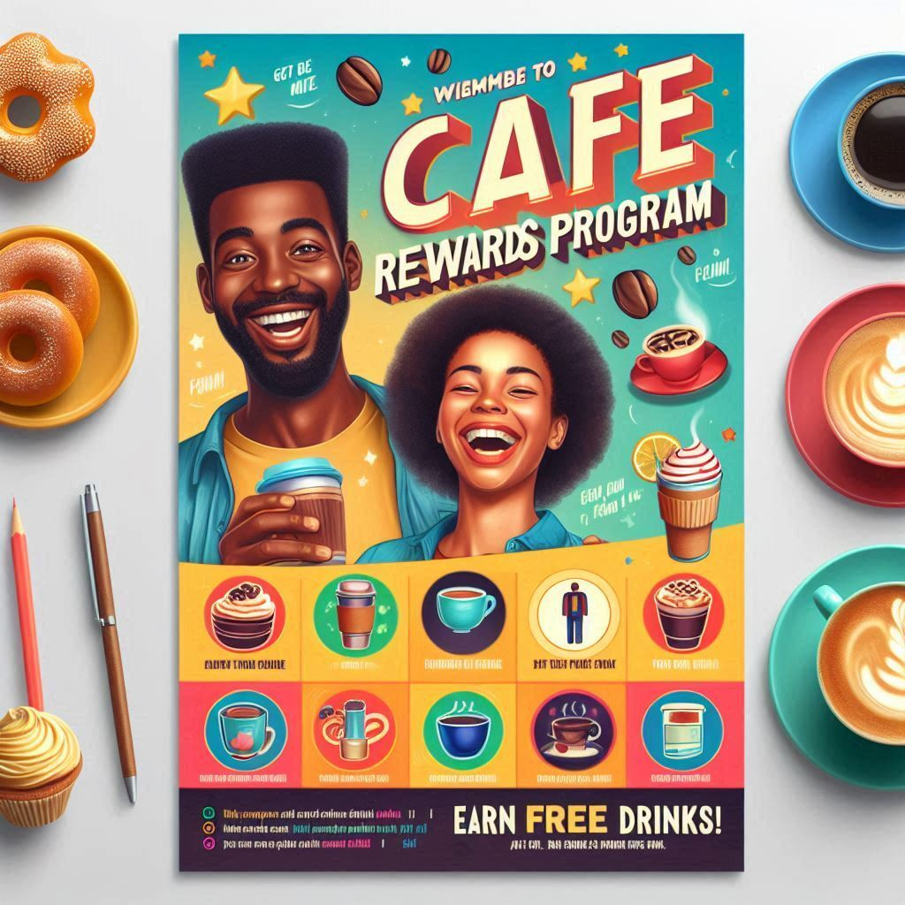

# [Cafe Rewards Members](https://mavenanalytics.io/challenges/maven-rewards-challenge/404c6060-60eb-400f-9bce-c3b9f97e9d5a)

## **North star metrics:** signup rate, signup count

## **Dimensions:** campaign category, campaing type, platform, time

## Connect csv to DB

1. Mount data folder to MYSQL docker container
1. Gain back access when done: `sudo chown -R your_wsl_username:your_wsl_username /home/blackitalian/ds_projects/cafe-rewards-members/data`
1.
